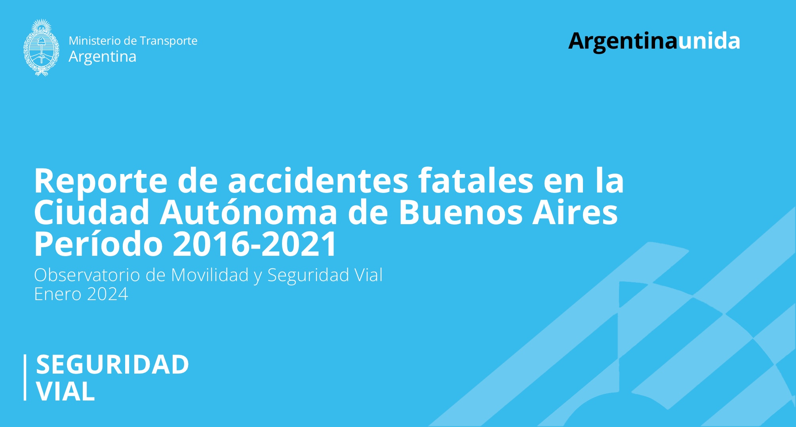
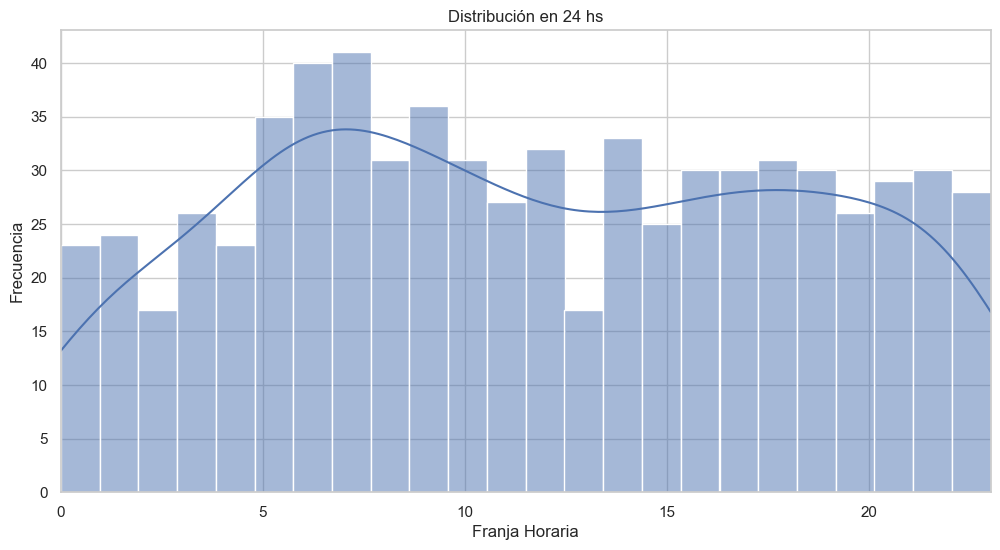
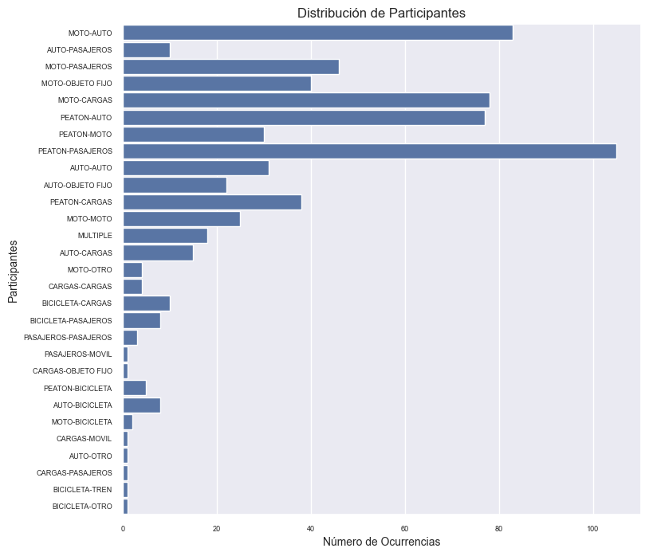
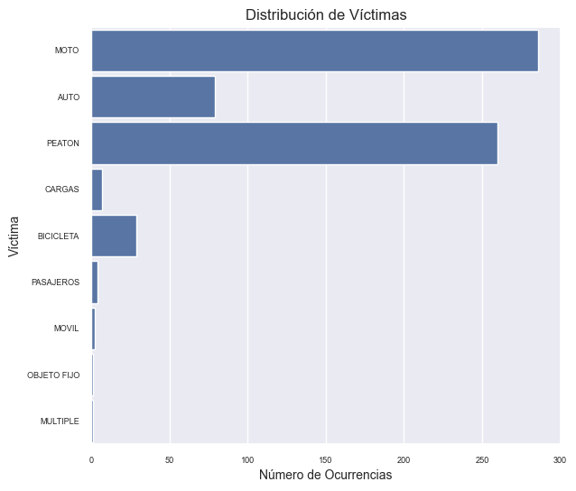
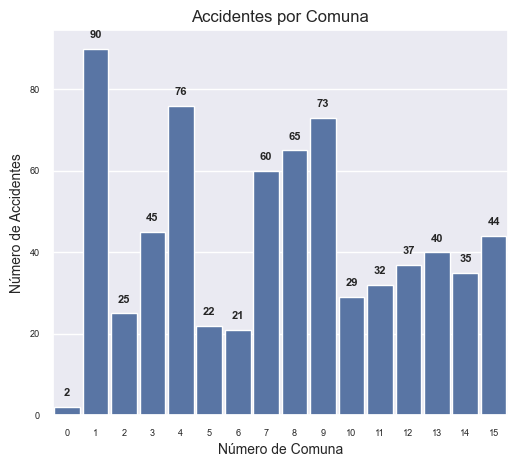
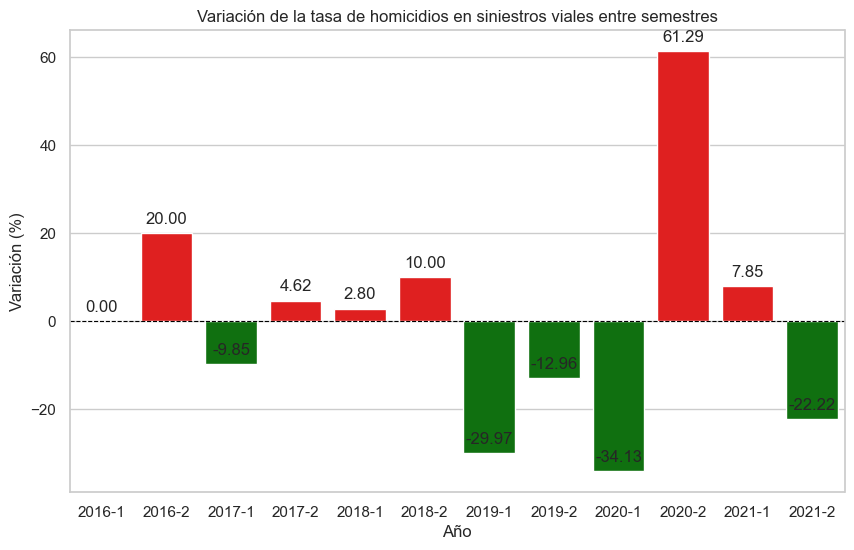
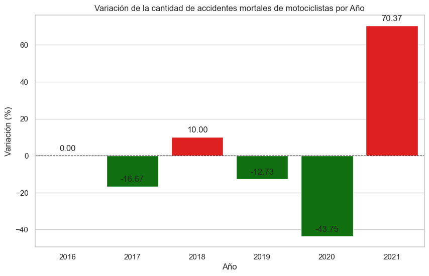
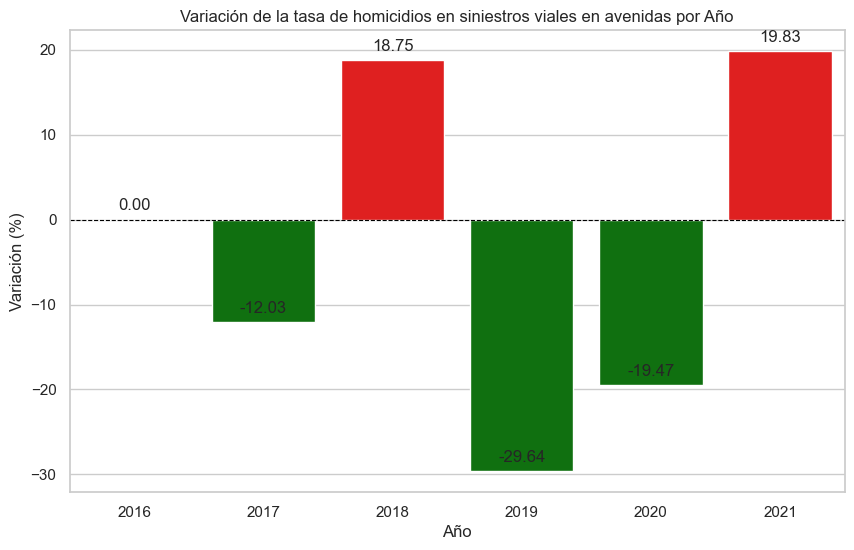

<h1 align=center>PIDA SiniestrosViales CABA</h1>

El proyecto "PIDA SiniestrosViales CABA" es el segundo de los proyectos integradores finales del Bootcamp de Data Science de Henry. El proyecto se centra en los datasets que cubren información sobre accidentes fatales en la Ciudad Autónoma de Buenos Aires entre los años 2016 y 2021. El objetivo principal de este proyecto fue realizar un análisis profundo de los datos.

**Siniestros viales en Buenos Aires: un problema grave**

Los siniestros viales son accidentes de tránsito que pueden causar daños materiales, lesiones graves o la muerte. En el contexto de una ciudad como Buenos Aires, los siniestros viales son un problema importante debido a la cantidad de vehículos y personas que circulan por la ciudad.

El Observatorio de Movilidad y Seguridad Vial (OMSV) del Gobierno de la Ciudad de Buenos Aires solicita la elaboración de un proyecto de análisis de datos para generar información que permita tomar medidas para disminuir la cantidad de víctimas fatales de los siniestros viales. Para ello, el OMSV proporciona un conjunto de datos sobre homicidios en siniestros viales acaecidos en la Ciudad de Buenos Aires durante el periodo 2016-2021.

El proyecto de análisis de datos tendrá como objetivo identificar las causas de los siniestros viales que resultan en homicidios en la Ciudad de Buenos Aires. Para ello, se analizarán los datos proporcionados por el OMSV, así como otros datos relevantes, como las estadísticas de tránsito, las condiciones de las calles y avenidas, y las características de los vehículos involucrados.

Los resultados del proyecto de análisis de datos se espera que brinden información valiosa a las autoridades locales para tomar medidas que permitan reducir la cantidad de homicidios en siniestros viales en la Ciudad de Buenos Aires.

Es importante tomar medidas para reducir los siniestros viales, ya que estos representan un problema grave que causa muchas muertes cada año.
---

# Detalles del Directorio:

- **datasets/**
  _La carpeta datasets esta subdividida en dos sub-carpetas_

   **procesados/**

    **homicidios.csv:** Data procesada sobre homicidios en accidentes viales en CABA.

    **homicidios_avenidas:** Data procesada sobre homicidios específicamente en avenidas, utilizada para calcular KPI.

    **homicidios_moto:** Data procesada sobre homicidios específicamente de víctimas en motocicletas, utilizada para calcular KPI.

    **homicidios_semestres:** Data procesada sobre homicidios clasificada por semestres, utilizada para calcular KPI.

   **originales/**

    **homicidios.xlsx:** Data original sobre homicidios en accidentes viales en CABA.
  
    **lesiones.xlsx:** Data original sobre lesiones en accidentes viales en CABA.

    **NOTAS_HOMICIDIOS_SINIESTRO_VIAL.pdf:** información complementaria.

_La subcarpeta "originales" incluye los datos sobre homicidios proporcionados por Henry para el análisis, mientras que la subcarpeta "procesados" contiene los dataframes resultantes del proceso EDA y ETL._

- **.gitignore:** Archivo para especificar archivos y directorios no rastreados que Git debería ignorar.

- **Accidentes Viales CABA.pbix:** Archivo Power BI que incluye dashboard interactivo e informe.

- **Dashboard_Preview.pdf:** Archivo PDF que incluye previsualización del dashboard (no interactivo).

- **EDA.ipynb:** Jupyter Notebook para Exploratory Data Analysis.

- **ETL.ipynb:** Jupyter Notebook que se concentra únicamente en extraer y transformar los datos necesarios en relación a la población de CABA para los años de 2016 a 2021.

- **KPIs.ipynb:** Jupyter Notebook para el cálculo de 3 indicadores clave de desempeño sobre accidentes en CABA.

---

# **EDA**

EDA realizado sobre el conjunto de datos de accidentes de tránsito en la Ciudad Autónoma de Buenos Aires (CABA) proporciona información valiosa sobre las tendencias y factores que contribuyen a estos accidentes.

**Principales hallazgos**

Los principales hallazgos del EDA son los siguientes:

* **Los accidentes de tránsito son más comunes en las primeras horas de la mañana, tanto en avenidas como en calles.** Esto se debe a una serie de factores, como el tráfico intenso, la fatiga de los conductores y la distracción.
* 

El gráfico anterior muestra que la distribución de accidentes por hora del día en CABA es desigual. La mayor cantidad de accidentes ocurre entre las 5:00 y las 9:00, con un total de 183 accidentes en un lapso de 5 horas.

Los accidentes también ocurren con frecuencia entre las 14:00 y las 22:00, con un total de 264 accidentes en un lapso de 9 horas.

- La mayor concentración de accidentes ocurre entre las 5:00 y las 9:00, lo que representa el 26,33% de los accidentes.
- Las horas entre las 5:00 y las 9:00 tienen un total del 22,07% de los accidentes.
- Las horas entre las 14:00 y las 22:00 tienen un total del 37,99% de los accidentes.
- Las horas entre las 10:00 y 13:00 tienen un total del 15,40% de los accidentes.

Los accidentes son menos comunes durante las horas del amanecer y alrededor del medio día, con un total de 248 accidentes en un total de 10 horas. En conjunto, estos accidentes representan el 37,47% de los accidentes.

* **Los accidentes entre vehículos motorizados son los mas frecuentes, representando el 44,54% del total. Seguido por los accidentes entre peatones y vehículos motorizados  representando el 37,37% del total.**

* **Las motocicletas son los vehículos más involucrados en accidentes viales, con una participación del 42,75%.** Esto se debe a que las motocicletas son más vulnerables a las colisiones y a que los conductores de motocicletas suelen tener menos experiencia que los conductores de otros vehículos.

* **La comuna 1 tiene la mayor cantidad de accidentes, con un total de 90.** Las comunas 4, 8, 9 y 15 también tienen una cantidad significativa de accidentes.

**Implicaciones para la seguridad vial**

Los hallazgos del EDA tienen implicaciones importantes para la seguridad vial. Por ejemplo, sugieren que es importante tomar medidas para reducir el tráfico en las primeras horas de la mañana, para aumentar la concienciación sobre los peligros de los peatones y las motocicletas, y para mejorar la seguridad de las avenidas.

**Recomendaciones para futuros análisis**

Los siguientes son algunos consejos para futuros análisis de los datos de accidentes de tránsito:

* **Se podría agregar información sobre las condiciones climáticas y el estado de la carretera.** Esto podría ayudar a comprender mejor los factores que contribuyen a los accidentes.
* **Se podría analizar la información sobre los conductores involucrados en los accidentes.** Esto podría ayudar a identificar factores de riesgo específicos, como el consumo de alcohol o drogas.
* **Se podría utilizar información de seguimiento para evaluar la eficacia de las medidas de seguridad vial.** Esto podría ayudar a garantizar que las medidas estén teniendo el efecto deseado.

---

# **KPIs**

Los KPIs, o indicadores clave de rendimiento, son medidas utilizadas para evaluar el progreso hacia los objetivos. En el contexto de la seguridad vial, los KPIs pueden utilizarse para medir la efectividad de las políticas y medidas implementadas para reducir la siniestralidad vial.

Los tres KPIs presentados en este documento se centran en la seguridad vial en la Ciudad Autónoma de Buenos Aires (CABA). Los objetivos de estos KPIs son:

* Reducir en un 10% la tasa de homicidios en siniestros viales de los últimos seis meses, en comparación con la tasa de homicidios en siniestros viales del semestre anterior.
* Reducir en un 7% la cantidad de accidentes mortales de motociclistas en el último año, en comparación con el año anterior.
* Reducir la tasa de homicidios en siniestros viales en avenidas en el último año, en comparación con el año anterior, con un índice de reducción superior al 10%.

Los resultados de los KPIs muestran que se ha logrado alcanzar el objetivo en un total de 6, 3 y 2 ocasiones, respectivamente. Sin embargo, es importante señalar que los resultados no son consistentes en el tiempo, y que se han observado tanto aumentos como disminuciones en los indicadores.

**Resultados**

En el período 2016-2021, se logró:

**1. Reducir la tasa de homicidios en siniestros viales en CABA en un total de 6 veces, lo que representa un 50% del objetivo.**

Los períodos en los que se logró reducir la tasa de homicidios en siniestros viales fueron:
* 1° semestre de 2017 no se alcanzó el objetivo pero estuvo muy proximo con una reducción del 9,85%
* 1° semestre de 2019 -29,97%
* 2° semestre de 1019 -12,96%
* 1° semestre de 2020 -34,13%
* 2° semestre de 2021 -21,22%

**2. Reducir la cantidad de accidentes mortales de motociclistas en CABA en un total de 3 veces, lo que representa un 60% del objetivo.**

Los períodos en los que se logró reducir la cantidad de accidentes mortales de motociclistas fueron:

* 2017: -16.67%
* 2019: -12.73%
* 2020: -43.75%

**3. Reducir la tasa de homicidios en siniestros viales en avenidas de CABA en un total de 2 veces, lo que representa el 40% del objetivo.**

Los períodos en los que se logró reducir la tasa de homicidios en siniestros viales en avenidas fueron:

* 2017: -12.03%
* 2019: -29.47%

**Observaciones**

El año 2020 se destaca por la reducción más significativa de la cantidad de accidentes mortales de motociclistas, con una disminución del 43.75%. Esta reducción se debe a la implementación de medidas de seguridad vial específicas, como la prohibición de los ciclomotores en el CABA y AMBA, la implementación de carriles exclusivos para motos y la instalación de semáforos y reductores de velocidad en zonas conflictivas.

Por otro lado, el año 2021 se destaca por el aumento más significativo de la cantidad de accidentes mortales de motociclistas, con un incremento del 70.37%. Este aumento se debe a la relajación de las medidas de seguridad vial implementadas durante la pandemia de COVID-19, como la reducción de los controles de alcoholemia y velocidad.

En general, los resultados de los KPIs muestran que se han logrado avances en la seguridad vial en CABA. Sin embargo, es necesario continuar trabajando para mejorar los resultados y alcanzar los objetivos establecidos.

**Recomendaciones**

Para mejorar los resultados de los KPIs, se recomienda:

* Fortalecer el cumplimiento de las normas de tránsito, en particular las relacionadas con el uso del cinturón de seguridad, el casco, el alcohol y la velocidad.
* Invertir en la mejora de la infraestructura vial, especialmente en las zonas con mayor siniestralidad.
* Desarrollar programas de educación vial para todos los usuarios de la vía pública.

La implementación de estas recomendaciones contribuiría a reducir la siniestralidad vial en CABA y mejorar la seguridad de todos los ciudadanos.
